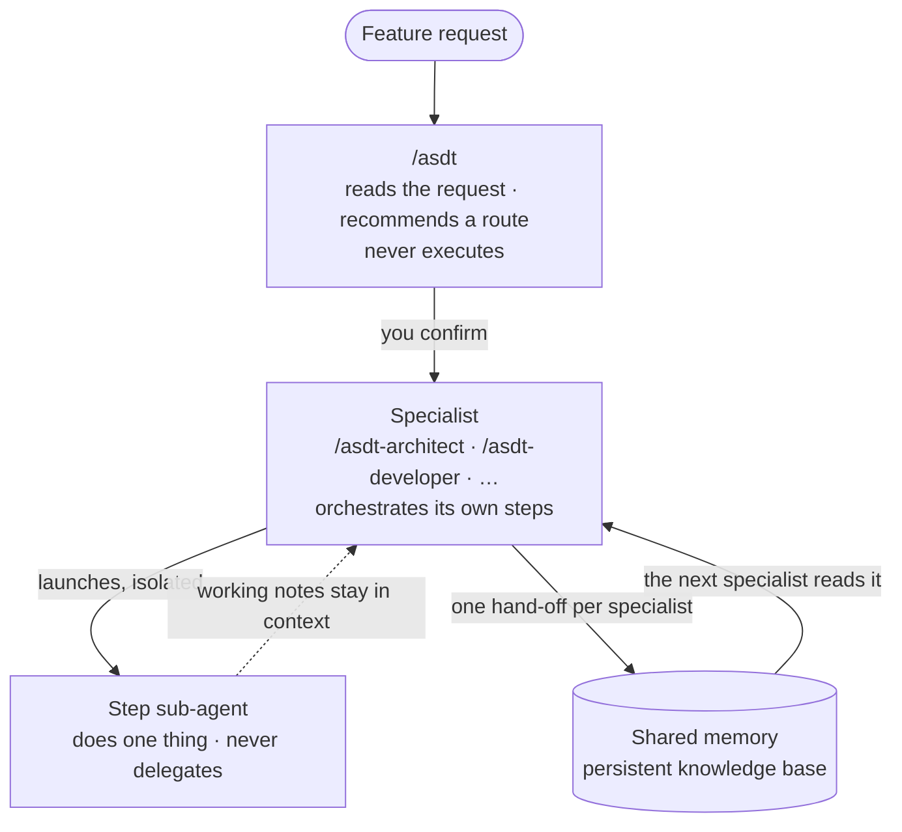

# AI Software Delivery Team (ASDT)

**A full software team of AI specialists — architect, developer, QA, security, UX — for when you're building alone.**

📖 **[Read the docs →](https://vitualizz.github.io/asdt)**

---

## What is ASDT?

A plain chat with an AI assistant improvises. It forgets what you decided yesterday, reinvents its process on every prompt, and leaves no trail behind.

ASDT turns that chat into a **team**. It installs a set of AI specialists into [Claude Code](https://claude.com/claude-code) or [OpenCode](https://opencode.ai) — each one owns a discipline and hands its work to the next through a shared memory:

- The **architect** decides → the **developer** builds on that decision → the **QA** tests what was built → the **security** engineer reviews it.
- You stay in charge: you describe what you need, ASDT suggests who should work on it and in what order, and you confirm.
- Nothing gets forgotten. Every decision, plan, and test lives in a shared knowledge base, so a specialist can pick up where another left off — minutes or days later.

> **AI-powered. Human-directed.** You lead, the team executes.

## Install

One command. No Go, no build, no config:

```sh
curl -fsSL https://raw.githubusercontent.com/vitualizz/asdt/main/install.sh | bash
```

It downloads the pre-built binary for your platform (Linux/macOS · x86_64/arm64) into `~/.local/bin/`.

> If `~/.local/bin` isn't on your `PATH`, the installer tells you exactly what line to add.

## Get started in 3 steps

**1. Install the specialists into your assistant**

```sh
asdt-tui
```

An interactive menu checks your setup, lets you pick which assistant(s) to target (Claude Code, OpenCode, or both), and copies the ASDT skills in.

**2. Initialize your project**

Open your AI assistant in your project folder and run:

```
/asdt-init
```

It detects your stack, asks a couple of questions, and writes `.asdt/config.yaml`.

**3. Put the team to work**

Not sure who you need? Just ask:

```
/asdt Add user authentication with email and password
```

ASDT analyzes the request and suggests a route — for example `/asdt-pm` → `/asdt-architect` → `/asdt-developer`. Confirm it, then run each command. Already know who you need? Call a specialist directly:

```
/asdt-developer Implement the password reset endpoint
```

## How it works

Three layers, and each one only does its own job:



**The router recommends.** `/asdt` reads your request, judges how much it touches and how much risk it carries, and proposes a chain of specialists. It never runs one.

**Each specialist finishes with exactly one hand-off.** Whatever it worked through on the way — exploration, drafts, intermediate analysis — stays in the conversation and disappears with it. What crosses the boundary to the next specialist is a single record at `{project}/{change}/{role}/handoff`, saved to a persistent memory layer (default: [Engram](https://github.com/Gentleman-Programming/engram)) rather than to files on disk. Work survives across sessions, and the next specialist picks it up without being told to.

**Steps run isolated.** A step that reads the codebase gets its own sub-agent so it never pollutes the others' context, and it never delegates further.

When a run produces a decision that would not be obvious from the code later, one line goes to the project journal. That is the only other thing ASDT writes.

The same skill tree installs natively into either host — one embedded source renders to both Claude Code and OpenCode.

## The specialists

Invoke any of these from inside your AI assistant:

| Command | What it does | Produces |
|---|---|---|
| `/asdt` | Route advisor — analyzes your request and recommends which specialists to run, in what order | Routing suggestion |
| `/asdt-init` | Initialize ASDT for the project — detects stack, writes config | `.asdt/config.yaml` |
| `/asdt-pm` | Turns loose ideas into user stories with clear scope and criteria | Backlog entry |
| `/asdt-architect` | Architecture decisions, system design, risk analysis | ADR + system design |
| `/asdt-developer` | Implementation plan with production code and tests | Step-by-step plan |
| `/asdt-qa` | Test plan and acceptance criteria | Test cases, quality report |
| `/asdt-security` | Threat model and hardening checklist | Security findings |
| `/asdt-ux-ui` | User flows, component specs, responsive strategy | UX brief, component spec |
| `/asdt-researcher` | Discovery and feasibility before requirements exist | Discovery brief |

**Unsure which one to use? Start with `/asdt`** — it points you to the right specialists for the job.

## Requirements

- [Claude Code](https://claude.com/claude-code) or [OpenCode](https://opencode.ai), installed and authenticated
- A memory provider for cross-session persistence — default is [Engram](https://github.com/Gentleman-Programming/engram), running before you invoke any specialist
- A terminal (bash or zsh)

> Want to build from source instead of the installer? You'll need Go 1.22+. The one-line installer needs nothing.

## Learn more

- **[Documentation](https://vitualizz.github.io/asdt)** — getting started, the specialist model, recipes, and more

## License

[MIT](LICENSE) — built in the open by Lee Palacios ([vitualizz](https://github.com/vitualizz)).
