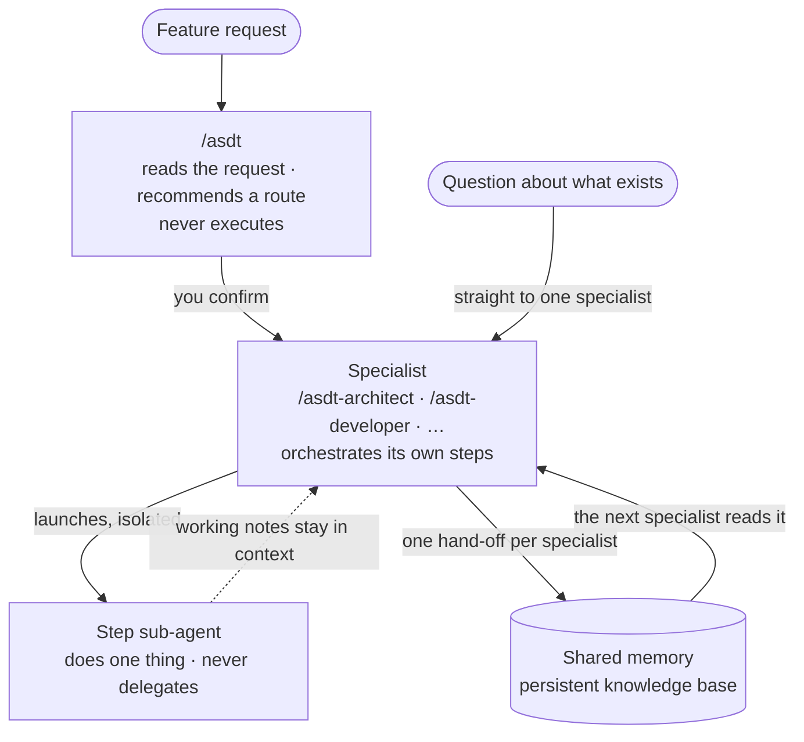

# AI Software Delivery Team (ASDT)

**A full software team of AI specialists — architect, developer, QA, security, UX — for when you're building alone.**

Ask one of them to look at what you already have, or hand the whole job to the team. Either way your project remembers: every decision one specialist makes is there for the next one, minutes or days later.

📖 **[Read the docs →](https://vitualizz.github.io/asdt)**

---

## What is ASDT?

A plain chat with an AI assistant improvises. It forgets what you decided yesterday, reinvents its process on every prompt, and leaves no trail behind.

ASDT turns that chat into a **team**. It installs a set of AI specialists into [Claude Code](https://claude.com/claude-code) or [OpenCode](https://opencode.ai), each one owning a discipline:

- **Any of them works on its own.** Point the security engineer at your payments module, ask the architect whether a structure will hold, ask QA what your tests are missing. No setup, no pipeline, no ceremony — one question, one answer.
- **Or they work as a team.** Describe what you want built and they pass the work between them: the architect decides, the developer builds on that decision, QA tests it, security reviews it. You say who runs and in what order — the team proposes, you confirm.
- **Your project remembers.** What each specialist worked out is kept, so the next one starts from it instead of from scratch. You can also just ask what the team decided last week.

> **AI-powered. Human-directed.** You lead, the team executes.

## Install

One command. No Go, no build, no config:

```sh
curl -fsSL https://raw.githubusercontent.com/vitualizz/asdt/main/install.sh | bash
```

It downloads the pre-built binary for your platform (Linux/macOS · x86_64/arm64) into `~/.local/bin/`.

> If `~/.local/bin` isn't on your `PATH`, the installer tells you exactly what line to add.

## Get started

**1. Install the specialists into your assistant**

```sh
asdt-tui
```

An interactive menu checks your setup, lets you pick which assistant(s) to target (Claude Code, OpenCode, or both), and copies the ASDT skills in.

**2. Initialize your project**

Open your AI assistant in your project folder and run:

```
/asdt-init
```

It detects your stack, asks a couple of questions, and writes `.asdt/config.yaml`.

**3. Ask a specialist**

The fastest way in. Point one at something you already have — no plan, no setup:

```
/asdt-security "audit the payments module"
```

It reads the code, tells you what it found, and keeps the findings for later. Every specialist works this way: `/asdt-architect "does this structure scale?"`, `/asdt-qa "what don't our auth tests cover?"`.

**4. Hand work to the team**

When there's something to build and you're not sure who you need, ask for the whole thing:

```
/asdt "add password reset"
```

The team reads the request and proposes who should work on it and in what order — say, the architect, then the developer, then security because passwords are involved. Confirm, and run the commands it gives you. Each one picks up what the previous left behind.

**5. Ask how it's going**

```
/asdt "what did we decide about the password hashing?"
```

That one is answered straight from what the team already worked out — no work is run.

## How it works

Three layers, and each one only does its own job:



**The router recommends.** `/asdt` reads your request, judges how much it touches and how much risk it carries, and proposes a chain of specialists. It never runs one.

**Each specialist finishes with exactly one hand-off.** Whatever it worked through on the way — exploration, drafts, intermediate analysis — stays in the conversation and disappears with it. What crosses the boundary to the next specialist is a single record at `{project}/{change}/{role}/handoff`, saved to a persistent memory layer (default: [Engram](https://github.com/Gentleman-Programming/engram)) rather than to files on disk. Work survives across sessions, and the next specialist picks it up without being told to.

**Steps run isolated.** A step that reads the codebase gets its own sub-agent so it never pollutes the others' context, and it never delegates further.

Under the hood, every specialist produces a structured hand-off before any code is written — what the industry calls spec-driven. You never have to think about it; it is why the next specialist can start from a decision instead of a guess.

When a run produces a decision that would not be obvious from the code later, one line goes to the project journal. That is the only other thing ASDT writes.

The same skill tree installs natively into either host — one embedded source renders to both Claude Code and OpenCode.

## The specialists

Invoke any of these from inside your AI assistant:

| Command | What it does | Produces |
|---|---|---|
| `/asdt` | Route advisor — analyzes your request and recommends which specialists to run, in what order | Routing suggestion |
| `/asdt-init` | Initialize ASDT for the project — detects stack, writes config | `.asdt/config.yaml` |
| `/asdt-pm` | Turns loose ideas into user stories with clear scope and criteria | Backlog entry |
| `/asdt-architect` | Architecture decisions, system design, risk analysis | ADR + system design |
| `/asdt-developer` | Implementation plan with production code and tests | Step-by-step plan |
| `/asdt-qa` | Test plan and acceptance criteria | Test cases, quality report |
| `/asdt-security` | Threat model and hardening checklist | Security findings |
| `/asdt-ux-ui` | User flows, component specs, responsive strategy | UX brief, component spec |
| `/asdt-researcher` | Discovery and feasibility before requirements exist | Discovery brief |

**Unsure which one to use? Start with `/asdt`** — it points you to the right specialists for the job.

## Requirements

- [Claude Code](https://claude.com/claude-code) or [OpenCode](https://opencode.ai), installed and authenticated
- A memory provider for cross-session persistence — default is [Engram](https://github.com/Gentleman-Programming/engram), running before you invoke any specialist
- A terminal (bash or zsh)

> Want to build from source instead of the installer? You'll need Go 1.22+. The one-line installer needs nothing.

## Learn more

- **[Documentation](https://vitualizz.github.io/asdt)** — getting started, the specialist model, recipes, and more

## License

[MIT](LICENSE) — built in the open by Lee Palacios ([vitualizz](https://github.com/vitualizz)).
