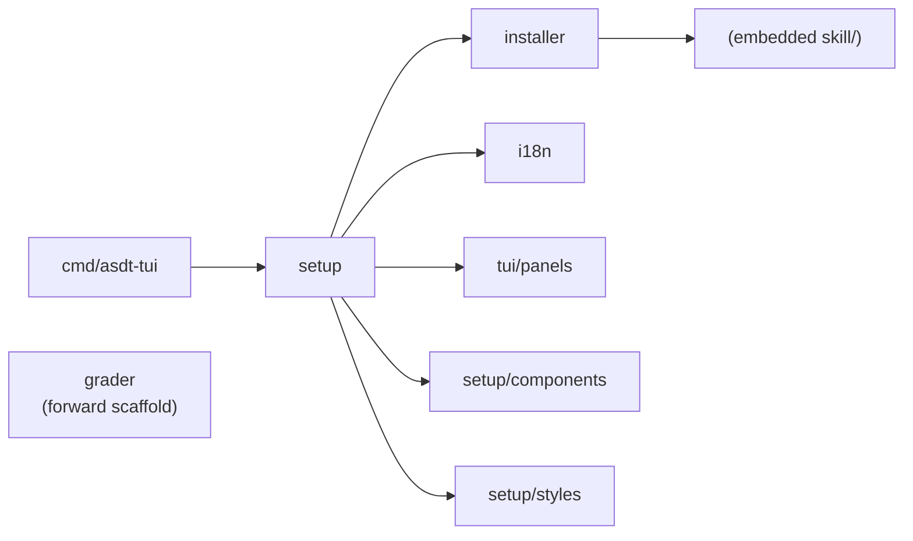

# internal/

Private packages for the `asdt-tui` binary — the installer TUI users run to copy ASDT skills into their AI assistant.

The AI specialist logic lives in `skill/`. This directory is the Go tooling that delivers those skills to the user's machine. All delivery orchestration (running specialists, storing artifacts, recalling context) happens inside the installed skills + Engram — not in Go. The binary's only runtime job is the install wizard.

## Packages

| Package | Responsibility |
|---|---|
| `setup/` | Bubbletea TUI — the interactive install wizard (entry point via `setup.New`). Subpackages: `components/` (reusable widgets), `styles/` (shared lipgloss styles) |
| `installer/` | Copy skills from the embedded filesystem to the assistant's skills directory, applying provider and per-step model customizations |
| `i18n/` | Bilingual catalog (English/Spanish) for the installer UI, with env-var language detection |
| `tui/panels/` | Presentational rendering primitives (badge, colors, hero, spinner, keyboard footer, focus border) consumed by `setup/` |
| `grader/` | Deterministic, panic-free probe grader: evaluates an artifact payload against a declarative `ProbeSet` to produce a PASS/FAIL/ERROR verdict. Forward scaffolding — not yet wired into the binary's runtime |

## Key Relationships

**`setup/`** is the composition root of the UI. `cmd/asdt-tui/main.go` embeds the `skill/` filesystem and hands it to `setup.New`. The wizard is a Bubbletea state machine (main menu → environment check → assistant selection → provider/model choices → review → installing → done).

**`installer/`** is the bridge between the embedded skill files and the user's machine. It reads `skill/` from the binary's embedded filesystem (`go:embed`) and writes each specialist directory to `~/.claude/skills/` or `~/.config/opencode/skills/`. `InstallWithModels` injects per-step model selections into each `workflow.yaml`; `InstallRemovingModels` strips the `model:` field for the Chameleon preset. One `InstallResult` is returned per assistant — failure for one does not abort the others.

**`grader/`** is standalone and stdlib-only (plus `gopkg.in/yaml.v3`). It exists ahead of its integration point so the artifact-validation contract can be developed and tested independently.

## Dependency Graph

