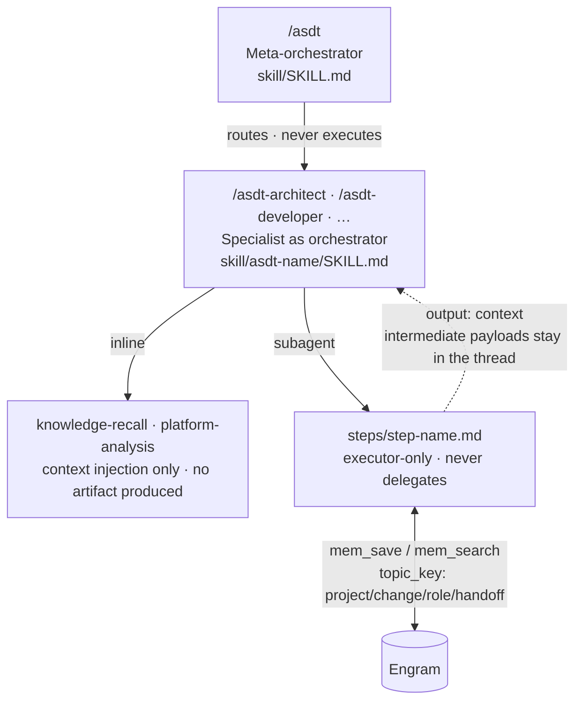

# ASDT Skills

This directory contains everything installed into the AI assistant. The Go binary (`asdt-tui`) copies these files into `~/.claude/skills/` (Claude Code) or `~/.config/opencode/skills/` (OpenCode) at install time.

## Three-Layer Execution Model



**Meta-orchestrator** (`skill/SKILL.md`) — the `/asdt` command only. Reads the request and answers one of three ways: a specialist chain, a single specialist, or — when the question is about the STATE of the work ("what did we decide about X?") — the answer itself, read inline from memory. It never executes a specialist step and never writes to memory.

**Specialist as orchestrator** (`skill/asdt-{name}/SKILL.md`) — reads `workflow.yaml` and drives the steps. Does not do the specialist work itself — it tells the calling assistant which steps to run inline and which to launch as isolated sub-agents.

**Step sub-agents** (`skill/asdt-{name}/steps/*.md`) — executor-only. No specialist requires another's work: every cross-specialist input is optional and degrades, which is what lets any of them run alone. Each step does one thing and returns. Only a specialist's LAST step persists, and what it persists is that specialist's single hand-off; earlier steps hand their payload back to the orchestrator, which injects it into the next step. Steps never delegate further.

The full contract — what gets persisted, how inputs arrive, how a step degrades when one is missing — lives in `asdt-core/protocol.md`. It is the one shared skill every run loads.

## Directory Structure

```
skill/
├── SKILL.md                    ← meta-orchestrator (/asdt)
├── TEMPLATE.md                 ← authoring contract for specialists (repo-only, not installed)
├── embedded.go                 ← go:embed — bundles this dir into the binary
├── asdt-{name}/                ← one directory per specialist
│   ├── SKILL.md                ← orchestration plan (ORCHESTRATOR GATE + step table)
│   ├── workflow.yaml           ← step registry: name, execution mode, inputs, outputs
│   └── steps/                  ← sub-agent prompt files (one per subagent step)
│       └── {step-name}.md
├── asdt-core/                  ← the protocol and its optional references
│   ├── protocol.md             ← the one mandatory shared skill
│   ├── specialist-header.md    ← spliced into every routed SKILL.md at install time
│   ├── executor-header.md      ← baked into generated agent definitions
│   └── references/             ← opt-in criteria loaded per step
│       └── {reference}.md
└── asdt-init/                  ← project initializer (/asdt-init)
```

## Step Execution Modes

Every step in `workflow.yaml` has an `execution:` field:

| Mode | What it means | Produces an artifact? |
|---|---|---|
| `inline` | Runs in the orchestrator's context — pure context injection | No |
| `subagent` | Launched as an isolated sub-agent | Only if it declares `output_topic_key` |

**Inline steps** (`knowledge-recall`, `platform-analysis`) inject context into the orchestrator's thread. They have no `inputs:` or `output_topic_key` — they enrich context for the next step.

**Subagent steps** each declare:
- `inputs:` — topic keys to retrieve from Engram before starting
- `output_topic_key` — where to save the hand-off in Engram
- `output: context` — declared *instead of* `output_topic_key`: the step persists nothing, and the orchestrator keeps its payload and injects it into the next step
- `context_inputs:` — the earlier `output: context` payloads this step expects, injected as `### INPUT {name}` blocks
- `reference_skills:` — which shared skill files to load as guidelines

## Artifact Topic Keys

Every artifact is stored in Engram under a structured key:

```
{project}/{change}/{role}/handoff

Examples:
  myapp/add-auth/architect/handoff
  myapp/add-auth/developer/handoff
  myapp/add-auth/security/handoff
```

One key per role per change. That is the whole address space for delivering a change: a specialist looking for upstream work knows exactly what to ask for, and a run that finds nothing there proceeds and says so.

The router's sharpened request is not one of these keys: it names no key, no field, and no file of its own — it lives only inside the quotes of the `/asdt-*` command the router emits, and it never reaches Engram.

A run that EXAMINES what already exists — an audit, a review, an assessment with nothing to deliver — persists under a second namespace instead:

```
{project}/study/{topic}/{role}

Examples:
  myapp/study/payments-module/security
  myapp/study/checkout-flow/architect
```

Which namespace applies is judged from the invocation, never declared: same schema, same load rules, same degradation. A past study is organizational memory — no step declares it as an input, and later runs meet it through the `knowledge-recall` prelude. The full contract is `asdt-core/protocol.md` §1.

A run that made a non-obvious decision also appends one line to `{project}/journal`. Nothing else is written.

## Adding a New Specialist

`TEMPLATE.md` in this directory is the normative contract for the steps below — required frontmatter, the fixed `SKILL.md` body order, the step-file layout, the artifact contract, and the registration mirrors. Read it before adding or normalizing a specialist. It is repo-only authoring guidance: `embedded.go` bundles `SKILL.md` and `asdt-*`, so nothing else at this level ships to user projects.

1. Create `skill/asdt-{name}/` with `SKILL.md`, `workflow.yaml`, and `steps/`
2. Add the ORCHESTRATOR GATE block to `SKILL.md` — copy from any existing specialist
3. Declare each step in `workflow.yaml` with `execution:`, `inputs:`, and either `output_topic_key:` or `output: context`
4. Write one `steps/{step-name}.md` per `subagent` step — the step file NEVER contains the EXECUTOR block. Those guardrails come from the agent definition (`agent: analyst` / `agent: builder`, which bake `asdt-core/executor-header.md` in) or, in every other case, from the orchestrator prepending that header to the sub-agent prompt. See `asdt-core/protocol.md` for which of the two applies
5. Register the specialist in the `Specialist Registry` section of `skill/SKILL.md`
